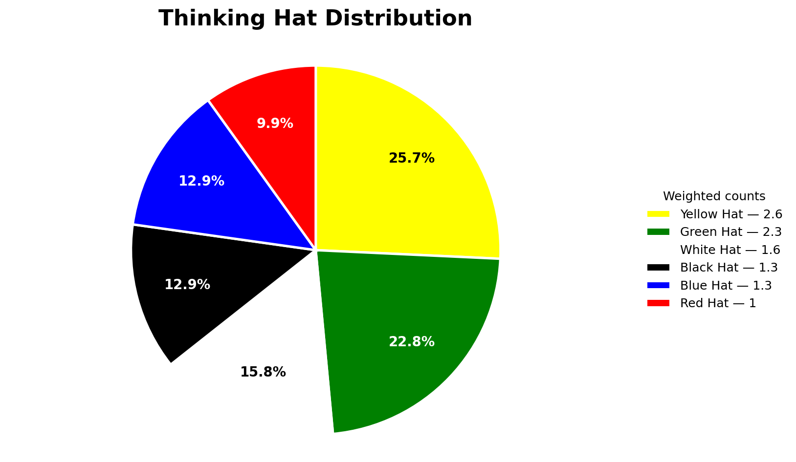

# Thinking Hats Transcript Analyzer

A small Python project that analyzes dialogue transcripts using Edward de Bono's **Six Thinking Hats** framework.

The script takes a raw transcript, cleans it, removes filler, labels each sentence with a dominant and secondary thinking hat, and creates a simple pie chart showing the distribution of thinking styles.

## Project files

```text
thinking-hats-transcript-analyzer/
├── main.py           # Run the project from the command line
├── thinking_hats.py  # Core analysis, label counting, and charting logic
├── prompts.py        # Prompt templates and examples
└── README.md         # Setup and usage instructions
```

## Features

- Cleans raw transcript text into readable dialogue
- Removes filler while preserving meaning
- Labels each sentence using the Six Thinking Hats framework
- Counts dominant and secondary hat labels
- Saves a text report and pie chart
- Uses `OPENAI_API_KEY` from the environment instead of hardcoding secrets

## Setup

Install the two required packages:

```bash
pip install openai matplotlib
```

Set your OpenAI API key:

```bash
export OPENAI_API_KEY="your_api_key_here"
```

On Windows PowerShell:

```powershell
setx OPENAI_API_KEY "your_api_key_here"
```

## Usage

Create a text file called `transcript.txt`, paste your transcript into it, and run:

```bash
python main.py transcript.txt
```

This creates two output files:

```text
analysis.txt
hat_distribution.png
```

You can also choose custom output names:

```bash
python main.py transcript.txt --output results.txt --chart chart.png
```

## Example output

Example annotated transcript:

```text
Daniel: The customer survey shows that 85% of users are satisfied with product quality (white) (none_s).
Samantha: I feel uneasy about reducing the price too much (red) (black_s).
Daniel: We could test a temporary discount before scaling it (green) (blue_s).
Samantha: Let us compare the data after two weeks and then decide the next step (blue) (white_s).
```

Example chart generated by the project:



## Scoring logic

Dominant hats count as `1.0`.

Secondary hats count as `0.3`.

Example:

```text
I feel uneasy about the pricing (red) (black_s).
```

This adds:

```text
red: 1.0
black: 0.3
```

## Security note

Never push API keys to GitHub. This project expects your key to be stored in the `OPENAI_API_KEY` environment variable.

## CV bullet

Refactored a notebook-based NLP prototype into a simple Python command-line project that analyzes dialogue transcripts using LLM prompt engineering, Six Thinking Hats classification, regex-based label parsing, and matplotlib visualization.
